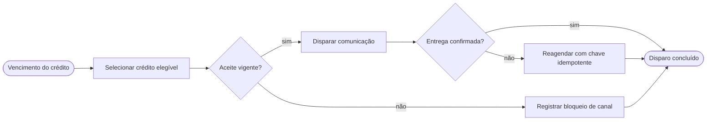
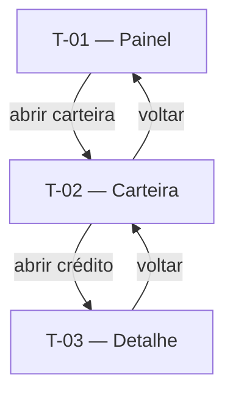

# Régua de cobrança — Requisitos

Fixture que passa limpa no `lint_critico.py`. Serve de referência de redação: prova que o
ruleset é satisfazível e mostra a forma esperada de RF, cenário, tela e dados.

## 1. Telas & Fluxos

### 1.1 Fluxo (Mermaid)



### 1.2 Telas detalhadas

#### T-01 — Painel da régua
- **Arquétipo:** A-01
- **Objetivo:** acompanhar volume e conversão da régua vigente.

```wireframe
# Painel da régua
[[ disparos | conversão | custo ]]
[~ série mensal ~]
[Abrir carteira]
```

- **Conteúdo:** contagem de disparos, conversão e custo unitário do mês.
- **Ações:** abrir carteira, abrir histórico.
- **Estados:** vazio, carregando, erro.
- **Navegação:** entra pelo menu; vai para T-02.
- **Componentes:** toolbar, card, chart, button.

#### T-02 — Carteira da régua
- **Arquétipo:** A-02
- **Objetivo:** filtrar os créditos cobertos pela régua.

```wireframe
# Carteira da régua
[Filtro____]
| crédito | fase | próximo disparo |
| crédito | fase | próximo disparo |
[Abrir crédito]
```

- **Conteúdo:** crédito, fase, próximo disparo previsto.
- **Ações:** filtrar, abrir crédito.
- **Estados:** vazio, carregando, erro.
- **Navegação:** vem de T-01; vai para T-03.
- **Componentes:** toolbar, input, table, button.

#### T-03 — Detalhe do disparo
- **Arquétipo:** A-03
- **Objetivo:** ver a trilha de um disparo e agir sobre ele.

```wireframe
# Detalhe do disparo
card "Situação":
  status do disparo
  protocolo do canal
- tentativa 1
- tentativa 2
[Reagendar] [Suspender]
```

- **Conteúdo:** situação, protocolo do canal, tentativas.
- **Ações:** reagendar, suspender.
- **Estados:** pendente, entregue, falho.
- **Navegação:** vem de T-02.
- **Componentes:** toolbar, card, list, button.

### 1.3 Diagrama de navegação (Mermaid)



---

## 2. Requisitos & Cenários de Teste

### 2.1 Personas & objetivos

| Persona | Objetivo | JTBD |
|---|---|---|
| Gestor de cobrança | Cobrar crédito vencido sem contato manual | JTBD-01 |
| Auditor interno | Provar o que foi comunicado ao contribuinte | JTBD-02 |

### 2.2 Requisitos Funcionais

| ID | Enunciado | Prioridade | RNs |
|---|---|---|---|
| RF-01 | O sistema deve manter uma versão vigente por régua de cobrança | Must | RN-01 |
| RF-02 | Quando o gestor publica uma régua, o sistema deve registrar a versão publicada | Must | RN-02 |
| RF-03 | Enquanto o aceite LGPD do contribuinte permanece vigente, o sistema deve liberar o disparo digital | Must | RN-03 |
| RF-04 | Se o conector devolve falha de entrega, então o sistema deve reagendar o disparo com chave idempotente | Must | RN-04 |
| RF-05 | Se a resposta do conector excede o timeout configurado, então o sistema deve marcar o disparo como pendente | Must | RN-04 |
| RF-06 | Se dois operadores gravam uma régua em concorrência, então o sistema deve recusar a segunda gravação | Must | RN-05 |
| RF-07 | Quando o lote de disparos termina em processamento parcial, o sistema deve exibir a contagem de itens pendentes | Should | RN-04 |
| RF-08 | Onde o canal WhatsApp existe na instância, o sistema deve exigir template aprovado antes do disparo | Must | RN-06 |
| RF-09 | Enquanto a régua está publicada, quando o calendário atinge D-5 do vencimento, o sistema deve disparar a comunicação preventiva | Must | RN-07 |

**Transversais aplicáveis:** `RF-T-01`.

### 2.3 Requisitos Não-Funcionais

Requisito não-funcional vive só em [requisitos transversais](../requisitos-transversais.md).
Aplicáveis a esta feature: `RNF-T-SEG-01`, `RNF-T-AUD-01`, `RNF-T-DISP-01`.

**Integrações:** ver catálogo transversal — esta feature usa: Conector.

### 2.4 Cenários de Teste

#### CT-01 — Régua tem uma versão vigente (verifica RF-01)
- **Dado** a régua "ICMS" com a versão 3 vigente
- **Quando** o gestor consulta a régua
- **Então** a versão 3 aparece como vigente e a versão 2 aparece como histórica

#### CT-02 — Publicação registra a versão (verifica RF-02)
- **Dado** a régua "ICMS" em rascunho na versão 4
- **Quando** o gestor publica a régua
- **Então** a versão 4 fica vigente com autor, data e fundamentação

#### CT-03 — Aceite vigente libera o canal digital (verifica RF-03)
- **Dado** o contribuinte X com aceite de SMS vigente
- **Quando** a régua alcança o passo de SMS
- **Então** o disparo sai pelo canal SMS

#### CT-04 — Falha de entrega gera reagendamento idempotente (verifica RF-04)
- **Dado** o disparo 77 com uma tentativa recusada pelo conector
- **Quando** a régua reprocessa o disparo 77 com a chave já usada
- **Então** existe uma única comunicação registrada e uma nova tentativa agendada

#### CT-05 — Timeout do conector deixa o disparo pendente (verifica RF-05)
- **Dado** o conector de SMS sem resposta por 30 segundos
- **Quando** a régua aguarda a confirmação
- **Então** o disparo fica pendente e entra na fila de reprocessamento

#### CT-06 — Gravação concorrente é recusada (verifica RF-06)
- **Dado** dois operadores com a régua "ICMS" aberta na versão 4
- **Quando** o segundo operador grava depois do primeiro
- **Então** a segunda gravação é recusada com aviso de versão desatualizada

#### CT-07 — Lote parcial expõe os pendentes (verifica RF-07)
- **Dado** um lote de 100 disparos com 12 recusas do conector
- **Quando** o lote termina
- **Então** o painel mostra 88 concluídos e 12 pendentes

#### CT-08 — Canal WhatsApp exige template aprovado (verifica RF-08)
- **Dado** um template de WhatsApp sem aprovação
- **Quando** a régua alcança o passo de WhatsApp
- **Então** o disparo fica bloqueado com motivo "template sem aprovação"

#### CT-09 — Preventiva sai em D-5 (verifica RF-09)
- **Dado** o crédito 900 com vencimento em 5 dias e a régua publicada
- **Quando** o calendário alcança D-5
- **Então** a comunicação preventiva sai pelo canal com aceite vigente

---

## 3. Dados

### 3.1 Entidades canônicas usadas

Entidades vêm de [modelo-dados.md](../modelo-dados.md); aqui só o uso na feature.

- **Régua** — define a sequência de passos executada pela feature.
- **Crédito** — alvo da cobrança; fornece fase e vencimento.
- **Conector** — entrega a comunicação no canal escolhido.
- **Aceite LGPD** — libera ou bloqueia o canal digital.

### 3.2 Entidades próprias da feature

#### regua_versao
| Campo | Tipo | Descrição |
|---|---|---|
| versao | número | Sequencial da publicação |
| autor | texto | Quem publicou |
| fundamentacao | texto | Justificativa da publicação |
| vigente_desde | data | Início da vigência |

#### disparo_log
| Campo | Tipo | Descrição |
|---|---|---|
| chave_idempotencia | texto | Impede duplicidade de tentativa |
| situacao | texto | Pendente, entregue ou falho |
| tentativas | número | Contagem de tentativas do canal |
| protocolo_canal | texto | Identificador devolvido pelo conector |

### 3.3 Relações

- Régua 1:N regua_versao — cada régua acumula suas publicações.
- Crédito 1:N disparo_log — cada crédito acumula seus disparos.

---

## Fontes
- fixture do lint crítico

## Relacionado
- [Visão](../visao.md)
- [Modelo de dados](../modelo-dados.md)
- [Requisitos transversais](../requisitos-transversais.md)
- [Telas comuns](../telas-comuns.md)
