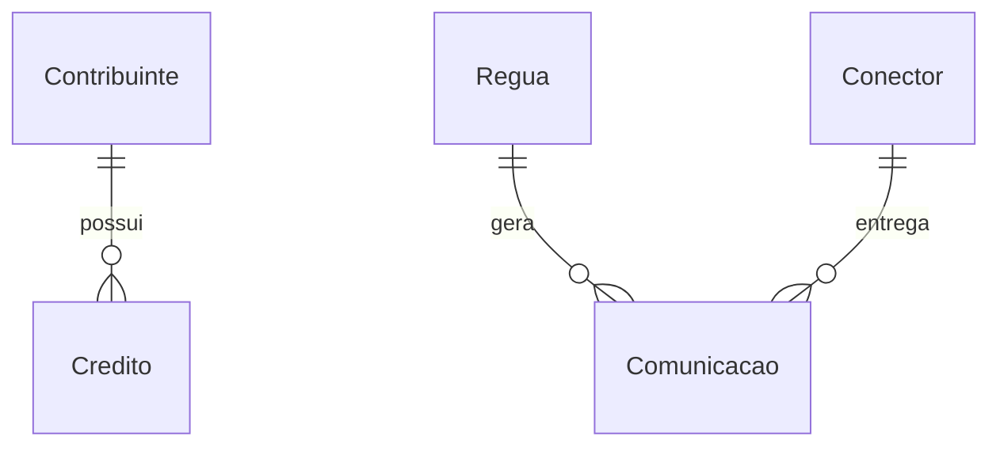

# Fixture — Modelo de dados canônico

## Entidades

- **Contribuinte** — Pessoa física ou jurídica com obrigação junto ao órgão.
- **Crédito** — Valor devido, com fase e situação.
- **Régua** — Sequência configurada de comunicações.
- **Conector** — Serviço de entrega por canal.
- **Aceite LGPD** — Consentimento vigente por canal e finalidade.

## Relações

