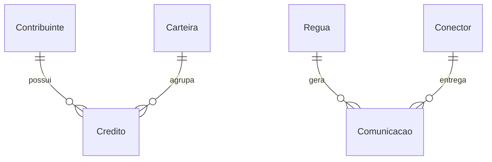
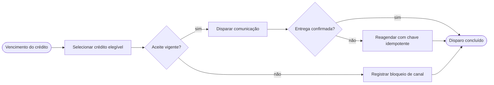
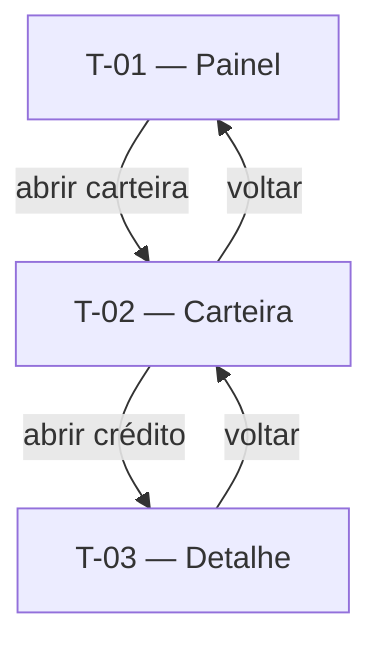
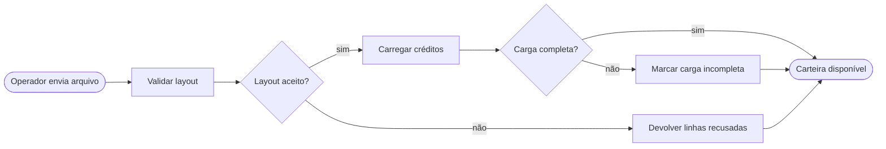
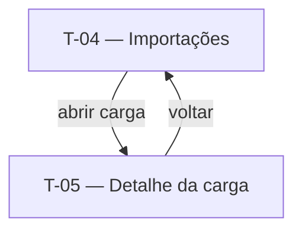

# Cobrança administrativa — Especificação

> Fixture que passa limpa no `lint_critico.py` no formato de **spec único**. Serve de
> referência de forma: seções numeradas, IDs contínuos no documento inteiro, requisito
> funcional em EARS-PT. Convenções: `*(inferência)*`, `⚠ NÃO IDENTIFICADO — definir: <x>`.

## 1. Contexto

### 1.1 Problema
Crédito vencido depende de contato manual do time de cobrança. O órgão não consegue
provar, depois, o que foi comunicado a cada contribuinte.

### 1.2 Objetivo
Cobrar crédito vencido por régua automática, com trilha que sustente auditoria.

### 1.3 Personas e necessidades

| Persona | Necessidade | ID |
|---|---|---|
| Gestor de cobrança | Cobrar crédito vencido sem contato manual | JTBD-01 |
| Auditor interno | Provar o que foi comunicado ao contribuinte | JTBD-02 |
| Operador de carteira | Carregar carteira de crédito sem retrabalho | JTBD-03 |

### 1.4 Não-objetivos
- Cobrança judicial e inscrição em dívida ativa.
- Negociação de parcelamento.

## 2. Glossário

| Termo | Definição | Fonte |
|---|---|---|
| Régua | Sequência configurada de comunicações a um contribuinte | fixture |
| Conector | Serviço que entrega a comunicação num canal | fixture |
| Carteira | Conjunto de créditos coberto por uma régua | fixture |

## 3. Regras de negócio

| ID | Regra | Fonte |
|---|---|---|
| RN-01 | Cada régua tem uma versão vigente por vez | fixture |
| RN-02 | Publicação de régua exige registro de versão | fixture |
| RN-03 | Disparo digital exige aceite LGPD vigente | fixture |
| RN-04 | Falha de entrega gera nova tentativa | fixture |
| RN-05 | Gravação concorrente de régua é resolvida pela primeira | fixture |
| RN-06 | Canal WhatsApp exige template aprovado | fixture |
| RN-07 | Comunicação preventiva sai em D-5 do vencimento | fixture |
| RN-08 | Toda importação de carteira é registrada com autor e data | fixture |
| RN-09 | Carteira só entra em régua depois de validação de layout | fixture |
| RN-10 | Reenvio de arquivo já carregado não duplica crédito | fixture |

## 4. Modelo de dados

Entidades canônicas do produto. Cada feature descreve só o que é próprio dela.

### 4.1 Entidades
- **Contribuinte** — Pessoa física ou jurídica com obrigação junto ao órgão.
- **Crédito** — Valor devido, com fase e vencimento.
- **Régua** — Sequência configurada de comunicações.
- **Conector** — Serviço de entrega por canal.
- **Aceite LGPD** — Consentimento vigente por canal e finalidade.
- **Carteira** — Agrupamento de créditos coberto por uma régua.

### 4.2 Relações



## 5. Requisitos transversais

Único lugar onde requisito não-funcional existe. Cada feature cita por ID.

### 5.1 Não-funcionais

| ID | Requisito | Mecanismo |
|---|---|---|
| RNF-T-SEG-01 | Acesso a régua e disparo segue a matriz perfil × ação do órgão | perfil por papel, negativa por omissão |
| RNF-T-AUD-01 | Toda comunicação gera trilha imutável com carimbo de tempo | PDF/A + SHA-256 + WORM |
| RNF-T-DISP-01 | Indisponibilidade de um canal não interrompe os demais | fila por canal, retry isolado |

### 5.2 Funcionais transversais

| ID | Requisito (EARS-PT) | RNs |
|---|---|---|
| RF-T-01 | Quando o usuário altera uma configuração, o sistema deve exigir fundamentação textual | RN-02 |

### 5.3 Integrações

| Sistema | Papel | Direção | Criticidade | Features |
|---|---|---|---|---|
| Conector de SMS | Entrega de comunicação | saída | alta | 7.1 |
| Portal de arquivos | Recebe a carteira do operador | entrada | média | 7.2 |

## 6. Arquétipos de tela

### A-01 — Painel de indicadores
Quando usar: visão agregada com poucos números e um gráfico.

```wireframe
# Painel
[[ número | número | número ]]
[~ série ~]
```

### A-02 — Lista com filtro
Quando usar: navegar num conjunto grande de registros.

```wireframe
# Lista
[Filtro____]
| coluna | coluna |
| coluna | coluna |
```

### A-03 — Detalhe de registro
Quando usar: ver e agir sobre um registro único.

```wireframe
# Detalhe
card "Situação":
  campo
[Ação]
```

## 7. Features

### 7.1 Régua de cobrança

**Eixo:** processo · **Apetite:** 6 semanas · **Fora desta feature:** negociação de parcelamento, cobrança judicial

#### 7.1.1 Fluxo e navegação





#### 7.1.2 Telas

##### T-01 — Painel da régua
- **Arquétipo:** A-01
- **Objetivo:** acompanhar volume e conversão da régua vigente.

```wireframe
# Painel da régua
[[ disparos | conversão | custo ]]
[~ série mensal ~]
[Abrir carteira]
```

- **Conteúdo:** contagem de disparos, conversão e custo unitário do mês.
- **Ações:** abrir carteira, abrir histórico.
- **Estados:** vazio, carregando, erro.
- **Componentes:** toolbar, card, chart, button.

##### T-02 — Carteira da régua
- **Arquétipo:** A-02
- **Objetivo:** filtrar os créditos cobertos pela régua.

```wireframe
# Carteira da régua
[Filtro____]
| crédito | fase | próximo disparo |
| crédito | fase | próximo disparo |
[Abrir crédito]
```

- **Conteúdo:** crédito, fase, próximo disparo previsto.
- **Ações:** filtrar, abrir crédito.
- **Estados:** vazio, carregando, erro.
- **Componentes:** toolbar, input, table, button.

##### T-03 — Detalhe do disparo
- **Arquétipo:** A-03
- **Objetivo:** ver a trilha de um disparo e agir sobre ele.

```wireframe
# Detalhe do disparo
card "Situação":
  status do disparo
  protocolo do canal
- tentativa 1
- tentativa 2
[Reagendar] [Suspender]
```

- **Conteúdo:** situação, protocolo do canal, tentativas.
- **Ações:** reagendar, suspender.
- **Estados:** pendente, entregue, falho.
- **Componentes:** toolbar, card, list, button.

#### 7.1.3 Requisitos funcionais

| ID | Enunciado (EARS-PT) | Prioridade | RNs |
|---|---|---|---|
| RF-01 | O sistema deve manter uma versão vigente por régua de cobrança | Must | RN-01 |
| RF-02 | Quando o gestor publica uma régua, o sistema deve registrar a versão publicada | Must | RN-02 |
| RF-03 | Enquanto o aceite LGPD do contribuinte permanece vigente, o sistema deve liberar o disparo digital | Must | RN-03 |
| RF-04 | Se o conector devolve falha de entrega, então o sistema deve reagendar o disparo com chave idempotente | Must | RN-04 |
| RF-05 | Se a resposta do conector excede o timeout configurado, então o sistema deve marcar o disparo como pendente | Must | RN-04 |
| RF-06 | Se dois operadores gravam uma régua em concorrência, então o sistema deve recusar a segunda gravação | Must | RN-05 |
| RF-07 | Quando o lote de disparos termina em processamento parcial, o sistema deve exibir a contagem de pendentes | Should | RN-04 |
| RF-08 | Onde o canal WhatsApp existe na instância, o sistema deve exigir template aprovado antes do disparo | Must | RN-06 |
| RF-09 | Enquanto a régua está publicada, quando o calendário atinge D-5, o sistema deve disparar a preventiva | Must | RN-07 |

**Transversais aplicáveis:** `RNF-T-SEG-01`, `RNF-T-AUD-01`, `RNF-T-DISP-01`, `RF-T-01`.

#### 7.1.4 Cenários de teste

##### CT-01 — Régua tem uma versão vigente (verifica RF-01)
- **Dado** a régua "ICMS" com a versão 3 vigente
- **Quando** o gestor consulta a régua
- **Então** a versão 3 aparece como vigente e a versão 2 como histórica

##### CT-02 — Publicação registra a versão (verifica RF-02)
- **Dado** a régua "ICMS" em rascunho na versão 4
- **Quando** o gestor publica a régua
- **Então** a versão 4 fica vigente com autor, data e fundamentação

##### CT-03 — Aceite vigente libera o canal digital (verifica RF-03)
- **Dado** o contribuinte X com aceite de SMS vigente
- **Quando** a régua alcança o passo de SMS
- **Então** o disparo sai pelo canal SMS

##### CT-04 — Falha de entrega gera reagendamento idempotente (verifica RF-04)
- **Dado** o disparo 77 com uma tentativa recusada pelo conector
- **Quando** a régua reprocessa o disparo 77 com a chave já usada
- **Então** existe uma única comunicação e uma nova tentativa agendada

##### CT-05 — Timeout do conector deixa o disparo pendente (verifica RF-05)
- **Dado** o conector de SMS sem resposta por 30 segundos
- **Quando** a régua aguarda a confirmação
- **Então** o disparo fica pendente e entra na fila de reprocessamento

##### CT-06 — Gravação concorrente é recusada (verifica RF-06)
- **Dado** dois operadores com a régua "ICMS" aberta na versão 4
- **Quando** o segundo operador grava depois do primeiro
- **Então** a segunda gravação é recusada com aviso de versão desatualizada

##### CT-07 — Lote parcial expõe os pendentes (verifica RF-07)
- **Dado** um lote de 100 disparos com 12 recusas do conector
- **Quando** o lote termina
- **Então** o painel mostra 88 concluídos e 12 pendentes

##### CT-08 — Canal WhatsApp exige template aprovado (verifica RF-08)
- **Dado** um template de WhatsApp sem aprovação
- **Quando** a régua alcança o passo de WhatsApp
- **Então** o disparo fica bloqueado com motivo "template sem aprovação"

##### CT-09 — Preventiva sai em D-5 (verifica RF-09)
- **Dado** o crédito 900 com vencimento em 5 dias e a régua publicada
- **Quando** o calendário alcança D-5
- **Então** a comunicação preventiva sai pelo canal com aceite vigente

#### 7.1.5 Dados

Entidades canônicas usadas (§4): Régua, Crédito, Conector, Aceite LGPD.

##### regua_versao
| Campo | Tipo | Descrição |
|---|---|---|
| versao | número | Sequencial da publicação |
| autor | texto | Quem publicou |
| fundamentacao | texto | Justificativa da publicação |
| vigente_desde | data | Início da vigência |

##### disparo_log
| Campo | Tipo | Descrição |
|---|---|---|
| chave_idempotencia | texto | Impede duplicidade de tentativa |
| situacao | texto | Pendente, entregue ou falho |
| tentativas | número | Contagem de tentativas do canal |
| protocolo_canal | texto | Identificador devolvido pelo conector |

### 7.2 Importação de carteira

**Eixo:** processo · **Apetite:** 2 semanas · **Fora desta feature:** deduplicação de contribuinte, enriquecimento cadastral

#### 7.2.1 Fluxo e navegação





#### 7.2.2 Telas

##### T-04 — Importações
- **Arquétipo:** A-02
- **Objetivo:** acompanhar as cargas de carteira do órgão.

```wireframe
# Importações
[Filtro____]
| arquivo | autor | situação |
| arquivo | autor | situação |
[Abrir carga]
```

- **Conteúdo:** arquivo, autor, data, situação da carga.
- **Ações:** filtrar, abrir carga.
- **Estados:** vazio, carregando, erro.
- **Componentes:** toolbar, input, table, button.

##### T-05 — Detalhe da carga
- **Arquétipo:** A-03
- **Objetivo:** ver o resultado de uma carga e as linhas recusadas.

```wireframe
# Detalhe da carga
card "Resultado":
  linhas aceitas
  linhas recusadas
| linha | motivo |
[Baixar recusadas]
```

- **Conteúdo:** contagem de aceitas e recusadas, motivo por linha.
- **Ações:** baixar recusadas.
- **Estados:** completa, incompleta, em processamento.
- **Componentes:** toolbar, card, table, button.

#### 7.2.3 Requisitos funcionais

| ID | Enunciado (EARS-PT) | Prioridade | RNs |
|---|---|---|---|
| RF-10 | O sistema deve registrar cada importação de carteira com autor e data | Must | RN-08 |
| RF-11 | Quando o operador envia um arquivo de carteira, o sistema deve validar o layout | Must | RN-09 |
| RF-12 | Se a leitura do arquivo excede o timeout configurado, então o sistema deve encerrar a carga | Must | RN-09 |
| RF-13 | Se a carga termina em processamento parcial, então o sistema deve listar as linhas recusadas | Must | RN-09 |
| RF-14 | Se o operador reenvia um arquivo já carregado em concorrência, então o sistema deve reaproveitar a carga | Must | RN-10 |

**Transversais aplicáveis:** `RNF-T-SEG-01`, `RNF-T-AUD-01`.

#### 7.2.4 Cenários de teste

##### CT-10 — Importação registra autor e data (verifica RF-10)
- **Dado** o operador Y autenticado
- **Quando** ele conclui a carga do arquivo "carteira-07.csv"
- **Então** a carga aparece com autor Y e a data do envio

##### CT-11 — Layout inválido barra a carga (verifica RF-11)
- **Dado** um arquivo sem a coluna "vencimento"
- **Quando** o operador envia o arquivo
- **Então** a carga é recusada e nenhum crédito entra na carteira

##### CT-12 — Timeout encerra a carga como incompleta (verifica RF-12)
- **Dado** um arquivo de 2 milhões de linhas e timeout de 10 minutos
- **Quando** a leitura alcança o timeout
- **Então** a carga fica incompleta com a contagem de linhas lidas

##### CT-13 — Carga parcial lista as recusadas (verifica RF-13)
- **Dado** um arquivo de 500 linhas com 20 vencimentos inválidos
- **Quando** a carga termina
- **Então** 480 créditos entram e as 20 linhas recusadas aparecem com motivo

##### CT-14 — Reenvio concorrente reaproveita a carga (verifica RF-14)
- **Dado** a carga de "carteira-07.csv" já concluída
- **Quando** o operador envia o arquivo outra vez em paralelo
- **Então** o sistema reaproveita a carga pela chave idempotente sem duplicar crédito

#### 7.2.5 Dados

Entidades canônicas usadas (§4): Carteira, Crédito, Contribuinte.

##### carga_log
| Campo | Tipo | Descrição |
|---|---|---|
| chave_idempotencia | texto | Identifica o arquivo já carregado |
| autor | texto | Operador que enviou |
| linhas_aceitas | número | Contagem de créditos carregados |
| linhas_recusadas | número | Contagem de linhas devolvidas |
| situacao | texto | Completa, incompleta ou em processamento |

## 8. Questões em aberto
- ⚠ NÃO IDENTIFICADO — definir: qual o prazo de retenção do arquivo de carteira depois da carga.

## 9. Fontes

| Referência | Tipo | Observação |
|---|---|---|
| fixture do lint crítico | fixture | conteúdo fictício |

## Anexo A — Vocabulário de componentes

Nomes genéricos de front usados nas telas, agnósticos de framework: toolbar, card,
table, list, button, input, select, tabs, dialog, chart, banner.

## Anexo B — Cadeia de valor

| Etapa | Features |
|---|---|
| Preparar carteira | 7.2 |
| Cobrar administrativamente | 7.1 |
