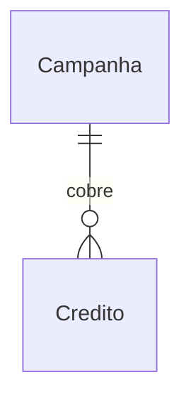

# Campanhas — Especificação

> Fixture negativa do formato **spec único**. Dispara as regras próprias desse formato:
> feature sem linha de metadados (`S06`), ID citado inexistente resolvido por seção
> (`X03`), além das regras de conteúdo. Mapa em `examples/lint/esperado-spec-ruim.txt`.

## 1. Contexto

### 1.1 Problema
Campanhas são organizadas em planilha solta.

### 1.2 Objetivo
Cadastrar campanha num lugar só.

### 1.3 Personas e necessidades

| Persona | Necessidade | ID |
|---|---|---|
| Gestor | Organizar campanhas | JTBD-01 |

### 1.4 Não-objetivos
- Disparo de comunicação.

## 2. Glossário

| Termo | Definição | Fonte |
|---|---|---|
| Campanha | Ação de comunicação com início e fim | fixture |

## 3. Regras de negócio

| ID | Regra | Fonte |
|---|---|---|
| RN-01 | Campanha tem início e fim | fixture |
| RN-02 | Publicação de campanha exige aprovação | fixture |

## 4. Modelo de dados

### 4.1 Entidades
- **Campanha** — Ação de comunicação com janela definida.
- **Crédito** — Valor devido pelo contribuinte.

### 4.2 Relações



## 5. Requisitos transversais

### 5.1 Não-funcionais

| ID | Requisito | Mecanismo |
|---|---|---|
| RNF-T-SEG-01 | Acesso segue matriz perfil × ação | perfil por papel |

### 5.2 Funcionais transversais

| ID | Requisito (EARS-PT) | RNs |
|---|---|---|
| RF-T-01 | Quando o usuário altera uma configuração, o sistema deve exigir fundamentação | RN-02 |

### 5.3 Integrações

| Sistema | Papel | Direção | Criticidade | Features |
|---|---|---|---|---|
| Portal | Publica a campanha | saída | baixa | 7.1 |

## 6. Arquétipos de tela

### A-01 — Lista com filtro
Quando usar: navegar registros.

```wireframe
# Lista
[Filtro____]
| coluna | coluna |
```

## 7. Features

### 7.1 Cadastro de campanha

#### 7.1.1 Fluxo e navegação


#### 7.1.2 Telas

##### T-01 — Cadastro da campanha
- **Objetivo:** cadastrar a campanha.

- **Conteúdo:** dados da campanha.
- **Ações:** salvar.
- **Componentes:** input, button.

#### 7.1.3 Requisitos funcionais

| ID | Enunciado (EARS-PT) | Prioridade | RNs |
|---|---|---|---|
| RF-01 | Permitir cadastrar campanha de forma amigável | Must | RN-01 |
| RF-02 | Cadastrar campanha e publicar campanha, quando aplicável | Must | RN-02 |
| RF-03 | Não usar razão social no canal público | Must | RN-99 |

#### 7.1.4 Cenários de teste

##### CT-01 — Cadastro da campanha
- **Dado** um gestor autenticado
- **Quando** ele salva a campanha
- **Então** a campanha aparece na lista

#### 7.1.5 Dados

##### Campanha
| Campo | Tipo | Descrição |
|---|---|---|
| nome | texto | Nome da campanha |
| situacao |  | Situação atual |

O envio usa o endpoint de publicação do portal.

## 8. Questões em aberto
- nenhuma

## 9. Fontes

| Referência | Tipo | Observação |
|---|---|---|
| fixture negativa | fixture | conteúdo fictício |
