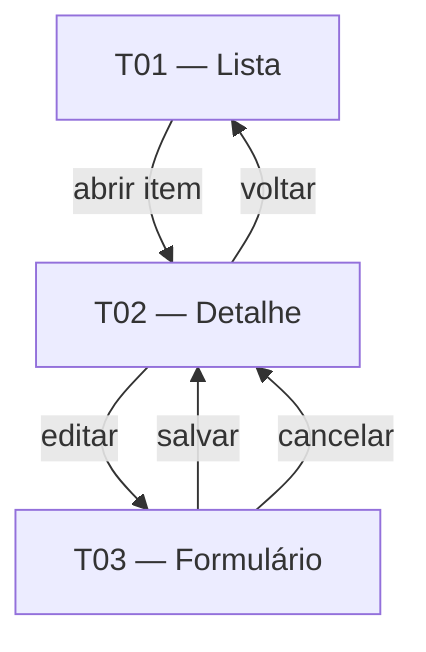

# <feature> — Contrato

> Documento único da Camada de Requisitos desta feature (3 capítulos). Responde:
> *como o usuário interage* (Cap. 1), *o que a feature deve cumprir, para quem e como
> provar* (Cap. 2) e *que informação manipula* (Cap. 3).
>
> **Pense transversalmente.** Antes de descrever qualquer coisa nesta feature, consulte os
> **documentos transversais** na raiz de `refined/` — eles concentram o que é comum a
> várias features, para não duplicar:
> - **[Modelo de dados](../modelo-dados.md)** — entidades canônicas do produto. O Cap. 3
>   desta feature **referencia** essas entidades; só descreve campos/entidades **próprios**.
> - **[Requisitos transversais](../requisitos-transversais.md)** — `RNF-T-*` / `RF-T-*`
>   cross-cutting. O Cap. 2 desta feature **cita os IDs** em vez de redefini-los.
> - **[Telas comuns](../telas-comuns.md)** — arquétipos de tela `A-NN`. Cada tela do Cap. 1
>   declara seu `**Arquétipo:**` e descreve só o que muda.
>
> **Eixo de granularidade** (`eixo` no frontmatter):
> - `processo` — a feature é um **fluxo/atividades**. O Cap. 1 funde fluxo e processo num único flowchart de processo na 1.1; o Cap. 3 **deriva** o modelo de dados das atividades do fluxo.
> - `classe` — a feature é um conjunto de **formulários/objetos**. A 1.1 é um flowchart simples do ciclo do formulário/registro; no Cap. 3 a própria classe **é** o modelo de dados (formulário ≈ classe).
>
> Marcar inferências com `*(inferência)*` e lacunas com `⚠ NÃO IDENTIFICADO — definir: <pergunta>`.

> **Regra de não-sobreposição (cada fato mora em UM lugar):**
> - Persona + objetivo (por que/para quem) → Cap. 2.1 Personas & objetivos. Intenção do usuário vive nos requisitos.
> - O que o sistema deve fazer + rastreio RN → Cap. 2.2 RF (tabela). Não repetir como prosa em outro lugar.
> - Como se prova (Dado/Quando/Então) → Cap. 2.4 Cenários de Teste.
> - Requisito comum a várias features → `RNF-T-*` / `RF-T-*` em `requisitos-transversais.md`, citado por ID; nunca reescrever o enunciado aqui.
> - Invariante de domínio (lei) → `RN-NN` na Visão, citado por ID; nunca reescrever o enunciado no contrato.
> - Necessidade macro → `JTBD-NN` na Visão; citar o ID, não reparafrasear.
> - Entidade de domínio → `modelo-dados.md`, citada por nome; o Cap. 3 só descreve o que é próprio da feature.
> - Arquétipo de tela → `telas-comuns.md` (`A-NN`); a tela do Cap. 1 só descreve o que muda.

---

## 1. Telas & Fluxos

> **Minimize telas.** O objetivo é o **menor número de telas e a menor complexidade**:
> antes de criar uma tela nova, verifique se um **arquétipo** de `telas-comuns.md` já a
> resolve, e prefira **fundir** vistas (abas, drawers, painéis laterais) a multiplicar
> telas. Cada tela do 1.2 declara seu `**Arquétipo:**` (`A-NN` de `telas-comuns.md`) e
> descreve **só o que muda** (colunas, filtros, ações, estados específicos), em vez de
> re-desenhar o wireframe do zero.
>
> **Wireframe por tela (DSL `wireframe`):** cada tela do 1.2 traz um bloco
> ` ```wireframe ` que esboça o layout. O render do navegador é **fat marker, só-layout**:
> mostra apenas formas (sem texto legível) — os rótulos que você escreve servem ao autor
> e à prosa. A DSL é line-based (de cima p/ baixo, stack vertical; 2 espaços indentam
> dentro de um `card`):
> - `# Texto` → barra de título (toolbar) · `## Texto` → subtítulo.
> - `[[ a | b | c ]]` → linha de N colunas iguais.
> - `card "Título":` + linhas indentadas (2 espaços) → card/região com filhos.
> - `[Rótulo____]` (≥2 underscores finais) → input · `[~ legenda ~]` → gráfico (chart).
> - `[Texto]` (curto, sem underscores) → botão.
> - `(!) texto` → alerta/banner · `- item` → item de lista.
> - `| a | b |` (linhas consecutivas) → tabela (1ª linha = cabeçalho) · texto livre → label.
>
> **Componentes** usam um **vocabulário genérico de front** (toolbar, card, table, list,
> button, input, select, slider, tabs, dialog, chart…), agnóstico de framework. Cada
> projeto mapeia esses nomes p/ sua lib concreta — ver `../componentes.md`.

### 1.1 Fluxo (Mermaid)
Flowchart Mermaid do fluxo da feature, agnóstico de UI. **Para `eixo=processo`**, este flowchart funde fluxo e processo (estilo BPMN leve): atividades e informações como nós, gateways de decisão como losangos, do gatilho às saídas — **não** há subseção 1.4 separada. **Para `eixo=classe`**, é um flowchart simples do ciclo do formulário/registro (criar → validar → salvar → editar). Nós = `<informação> → <ação> → <resultado>`; `{}` = decisões; `([])` = gatilho/saídas.

> Legenda: nós `[ ]` = informação/ação/resultado · losangos `{ }` = decisões · `([ ])` = gatilho e saídas.


### 1.2 Telas detalhadas
Para cada tela, uma subseção. **Primeiro** procure o arquétipo correspondente em
`../telas-comuns.md`; descreva apenas o que diverge dele.

#### <id da tela> — <nome>
- **Arquétipo:** <A-NN de ../telas-comuns.md, ou "—" se for tela específica sem arquétipo>
- **Objetivo:** <para que serve>

```wireframe
# <nome da tela>
[[ resumo A | resumo B | status ]]
[~ gráfico principal ~]
(!) <alerta, se houver>
[Ação primária] [Ação secundária]
```

- **Conteúdo:** <que informação exibe>
- **Ações:** <o que o usuário pode fazer>
- **Estados:** <vazio, carregando, erro, sucesso — os aplicáveis>
- **Navegação:** <de onde chega, para onde vai>
- **Componentes:** <nomes genéricos referenciados de ../componentes.md — ex.: toolbar, card, table, list, button, input, chart>

### 1.3 Diagrama de navegação (Mermaid) — obrigatório
Diagrama de navegação entre as telas do Cap. 1.2. Cada nó é uma tela (use o `<id da tela>`); cada aresta é uma transição rotulada com a ação que a dispara.



---

## 2. Requisitos & Cenários de Teste

> Origem: <regras `RN-NN` da Visão que originam estes requisitos>.
> Horizonte: **<H1 / H2 / H3>**.
>
> **Antes de escrever:** consulte `../requisitos-transversais.md`. Os requisitos comuns a
> várias features (`RNF-T-*`, `RF-T-*`) **não** se reescrevem aqui — só se **citam** por ID.
> Este capítulo absorve também a **intenção do usuário** (2.1 Personas & objetivos): quem usa
> a feature e o que cada persona quer alcançar. Não há mais capítulo de "Histórias".

### 2.1 Personas & objetivos
<Quem usa a feature e o que cada persona quer alcançar — a intenção do usuário, antes condensada em histórias. As personas são definidas na Visão (Cap. 1 de ../visao.md); aqui só se lista persona → objetivo. Mantém a feature ancorada no usuário sem duplicar a jornada como artefato separado.>

| Persona | Objetivo (o que quer alcançar com a feature) | JTBD |
|---|---|---|
| <persona, da Visão §1> | <resultado que a persona busca> | <JTBD-NN, citado por ID> |

### 2.2 Requisitos Funcionais
<Tabela de requisitos funcionais. Um `RF-NN` por linha; cada um rastreável a regras (`RN`) e à(s) persona(s) que serve. Requisitos funcionais comuns a várias features vivem como `RF-T-NN` em ../requisitos-transversais.md — cite-os, não os reescreva.>

| ID | Enunciado | Prioridade | RNs | Persona |
|---|---|---|---|---|
| RF-01 | <o que o produto deve fazer> | <Must / Should / Could> | <RN-NN> | <persona> |

**Transversais aplicáveis:** <liste os `RF-T-NN` de ../requisitos-transversais.md que valem para esta feature — ex.: `RF-T-01`, `RF-T-03`.>

### 2.3 Requisitos Não-Funcionais
<Agrupar os RNF **específicos** da feature por categoria; incluir apenas categorias aplicáveis. Um marcador `RNF-<categoria>-NN` por requisito. Os RNF comuns (`RNF-T-*`) vivem em ../requisitos-transversais.md — cite-os no bloco "Transversais aplicáveis", não os reescreva. Só detalhe aqui o que **diverge** ou **acrescenta** ao transversal (ex.: um threshold de throughput próprio).>

#### Performance
- **RNF-P-01** — <requisito de desempenho próprio da feature — throughput, latência>.

#### Segurança
- **RNF-S-01** — <requisito de segurança próprio da feature>.

#### Disponibilidade
- **RNF-D-01** — <requisito de disponibilidade próprio da feature>.

#### (outras categorias aplicáveis: Auditoria, Conformidade, Escalabilidade, Observabilidade)

**Transversais aplicáveis:** <liste os `RNF-T-*` de ../requisitos-transversais.md que valem para esta feature — ex.: Segurança `RNF-T-SEG-01`, `RNF-T-SEG-02`; Auditoria `RNF-T-AUD-01`.>

### 2.4 Cenários de Teste
<Cenários que validam os requisitos acima, no formato Gherkin-like (Dado/Quando/Então). Cada cenário rastreia o(s) `RF-NN` (ou `RF-T-NN` / `RNF-T-*`) que verifica. Cobrir caminho feliz, exceções e estados de borda relevantes.>

#### CT-01 — <título do cenário> (verifica RF-NN)
- **Dado** <pré-condição / estado inicial>
- **Quando** <ação do usuário ou evento>
- **Então** <resultado esperado / estado final>

---

## 3. Dados

> **Modelo de dados conceitual da feature — referência o transversal, não o duplica.** As
> entidades canônicas do produto vivem em **[../modelo-dados.md](../modelo-dados.md)**. Este
> capítulo **referencia** essas entidades por nome e descreve **apenas o que é próprio** da
> feature: configurações, logs e instâncias de execução (ex.: tabelas de `*_log`,
> `*_execucao`) e os campos específicos que a feature acrescenta. Não re-modelar aqui uma
> entidade canônica.
>
> **Como derivar conforme o `eixo`:**
> - `eixo=classe` — cada formulário/objeto do Cap. 1 **é** uma entidade; se já existe em
>   `modelo-dados.md`, apenas referencie-a e liste os campos próprios.
> - `eixo=processo` — derivar as entidades das **atividades** do fluxo (Cap. 1): cada
>   informação processada/produzida referencia uma entidade canônica ou vira entidade
>   própria da feature.
>
> **Proibido** neste capítulo: endpoints, contratos de API, métodos HTTP, DDL/SQL, tipos de banco específicos. Apenas o modelo conceitual — entidades, campos e relações. Usar a terminologia do Glossário (Cap. 2 de visao.md).

### 3.1 Entidades canônicas usadas
<Liste as entidades de ../modelo-dados.md que esta feature consome, por nome, sem re-modelá-las.>
- **<Entidade canônica>** (ver [../modelo-dados.md](../modelo-dados.md)) — <como a feature a usa>.

### 3.2 Entidades próprias da feature
<Apenas as entidades específicas desta feature — configurações, logs, instâncias de execução — que não são canônicas.>

#### <Entidade própria>  <!-- (deriva de: <formulário/classe> | <atividade do fluxo>; referencia <entidade canônica> de ../modelo-dados.md) -->
| Campo | Tipo | Descrição |
|---|---|---|
| <campo> | <texto / número / data / booleano / referência> | <descrição> |

### 3.3 Relações
- <Entidade A> <1:N | N:N | 1:1> <Entidade B> — <descrição> (entidades canônicas referenciadas de ../modelo-dados.md)

---

## Questões em aberto
<marcadores ⚠ NÃO IDENTIFICADO — definir: <pergunta> — pontos não definidos ou pendentes de decisão. Opcional.>

## Fontes
- <entidade da feature, brainstorm, documento de origem usados para preencher este contrato>

## Relacionado
- [Visão do produto](../visao.md)
- [Modelo de dados (transversal)](../modelo-dados.md)
- [Requisitos transversais](../requisitos-transversais.md)
- [Telas comuns (arquétipos)](../telas-comuns.md)
- [Vocabulário de componentes](../componentes.md)
- [Outra feature](<feature>.md) <!-- mesma pasta Requisitos/ -->
- [Índice do wiki](../index.md)
