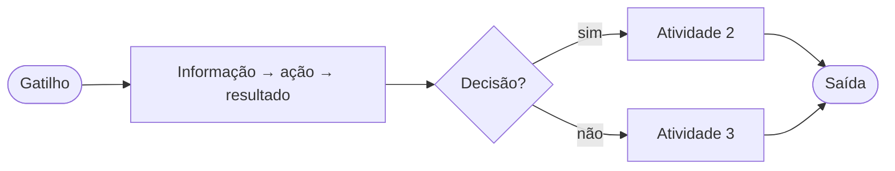
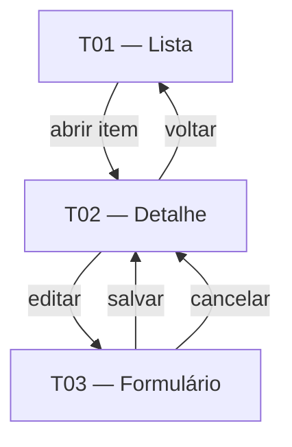

# <feature> — Contrato

> Documento único da Camada de Contrato desta feature (4 capítulos). Responde:
> *como o usuário interage* (Cap. 1), *o que a feature entrega* (Cap. 2),
> *o que o produto deve cumprir e como provar* (Cap. 3) e *que informação manipula* (Cap. 4).
>
> **Eixo de granularidade** (`eixo` no frontmatter):
> - `processo` — a feature é um **fluxo/atividades**. O Cap. 1 funde fluxo e processo num único flowchart de processo na 1.1; o Cap. 4 **deriva** o modelo de dados das atividades do fluxo.
> - `classe` — a feature é um conjunto de **formulários/objetos**. A 1.1 é um flowchart simples do ciclo do formulário/registro; no Cap. 4 a própria classe **é** o modelo de dados (formulário ≈ classe).
>
> Marcar inferências com `*(inferência)*` e lacunas com `⚠ NÃO IDENTIFICADO — definir: <pergunta>`.

> **Regra de não-sobreposição (cada fato mora em UM lugar):**
> - Por que/para quem + jornada da persona → Cap. 2 Histórias (Objetivo + Passos). Proibido repetir em Cap. 3.
> - O que o sistema deve fazer + rastreio RN/US → Cap. 3.1 RF (tabela). Não repetir como prosa no Cap. 2.
> - Como se prova (Dado/Quando/Então) → Cap. 3.3 Cenários. As User Stories NÃO levam 'Critérios de aceite'.
> - Invariante de domínio (lei) → RN-NN na Visão, citado por ID; nunca reescrever o enunciado no contrato.
> - Necessidade macro → JTBD-NN na Visão; o Epic cita o ID, não reparafraseia.

---

## 1. Telas & Fluxos

### 1.1 Fluxo (Mermaid)
Flowchart Mermaid do fluxo da feature, agnóstico de UI. **Para `eixo=processo`**, este flowchart funde fluxo e processo (estilo BPMN leve): atividades e informações como nós, gateways de decisão como losangos, do gatilho às saídas — **não** há subseção 1.4 separada. **Para `eixo=classe`**, é um flowchart simples do ciclo do formulário/registro (criar → validar → salvar → editar). Nós = `<informação> → <ação> → <resultado>`; `{}` = decisões; `([])` = gatilho/saídas.

> Legenda: nós `[ ]` = informação/ação/resultado · losangos `{ }` = decisões · `([ ])` = gatilho e saídas.

### 1.2 Telas detalhadas
Para cada tela, uma subseção:

#### <id da tela> — <nome>
- **Objetivo:** <para que serve>
- **Conteúdo:** <que informação exibe>
- **Ações:** <o que o usuário pode fazer>
- **Estados:** <vazio, carregando, erro, sucesso — os aplicáveis>
- **Navegação:** <de onde chega, para onde vai>
- **Blocos:** <blocos referenciados de ../_componentes.md>

### 1.3 Diagrama de navegação (Mermaid) — obrigatório
Diagrama de navegação entre as telas do Cap. 1.2. Cada nó é uma tela (use o `<id da tela>`); cada aresta é uma transição rotulada com a ação que a dispara.

---

## 2. Histórias

### 2.1 Epic
<Descrição do épico da feature em 1–2 frases — o que entrega e para quem. Cita o `JTBD-NN` da Visão por ID, sem reparafrasear o enunciado.>

**Métricas:** <IM-NN / NSM relevantes da Visão (Cap. 3 de visao.md)>

### 2.2 Backlog
<Tabela-resumo das histórias da feature.>

| ID | Título | Persona | Prioridade |
|---|---|---|---|
| US-01 | <título> | <persona> | <Must / Should / Could> |

### 2.3 User Stories
Para cada história, uma subseção. As User Stories **não** levam critérios de aceite — a prova vive nos cenários do Cap. 3.3.

#### <ID> — <título da história>
- **Persona:** <persona> (link para ../../entities/personas/<x>.md)
- **Objetivo:** Como <persona>, quero <ação>, para <benefício>.
- **Passos da jornada:** <lista ordenada>
- **Telas acionadas:** <ids de tela do Cap. 1>
- **Capacidades de IA:** <RN-AI-NN, se aplicável>

---

## 3. Requisitos & Cenários de Teste

> Origem: <regras `RN-NN` da Visão e histórias `US-NN` do Cap. 2 que originam estes requisitos>.
> Horizonte: **<H1 / H2 / H3>**.

### 3.1 Requisitos Funcionais
<Tabela de requisitos funcionais. Um `RF-NN` por linha; cada um rastreável a regras (`RN`) e histórias (`US`).>

| ID | Enunciado | Prioridade | RNs | US |
|---|---|---|---|---|
| RF-01 | <o que o produto deve fazer> | <Must / Should / Could> | <RN-NN> | <US-NN> |

### 3.2 Requisitos Não-Funcionais
<Agrupar os RNF por categoria. Incluir apenas as categorias aplicáveis à feature. Um marcador `RNF-<categoria>-NN` por requisito.>

#### Performance
- **RNF-P-01** — <requisito de desempenho — throughput, latência>.

#### Segurança
- **RNF-S-01** — <requisito de segurança / proteção de dados>.

#### Disponibilidade
- **RNF-D-01** — <requisito de disponibilidade / resiliência>.

#### Auditoria
- **RNF-A-01** — <requisito de rastreabilidade / trilha de auditoria>.

#### Conformidade
- **RNF-C-01** — <requisito de conformidade regulatória>.

#### Escalabilidade
- **RNF-E-01** — <requisito de escala / volume suportado>.

#### Observabilidade
- **RNF-O-01** — <requisito de métricas / monitoramento>.

### 3.3 Cenários de Teste
<Cenários que validam os requisitos acima, no formato Gherkin-like (Dado/Quando/Então). Cada cenário rastreia o(s) `RF-NN` (e/ou `US-NN`) que verifica. Cobrir caminho feliz, exceções e estados de borda relevantes.>

#### CT-01 — <título do cenário> (verifica RF-NN / US-NN)
- **Dado** <pré-condição / estado inicial>
- **Quando** <ação do usuário ou evento>
- **Então** <resultado esperado / estado final>

---

## 4. Dados

> **Modelo de dados conceitual da feature — derivado, não paralelo:** o conteúdo deste capítulo nasce do eixo da feature, não é um artefato independente.
>
> **Como derivar conforme o `eixo`:**
> - `eixo=classe` — cada formulário/objeto do Cap. 1 **é** uma entidade; os campos do formulário são os campos da classe. A classe já é o modelo de dados (formulário ≈ classe).
> - `eixo=processo` — derivar as entidades das **atividades** do fluxo (Cap. 1): cada informação processada/produzida vira entidade ou campo.
>
> **Proibido** neste capítulo: endpoints, contratos de API, métodos HTTP, DDL/SQL, tipos de banco específicos. Apenas o modelo conceitual — entidades, campos e relações. Usar a terminologia do Glossário (Cap. 2 de visao.md).

### 4.1 Entidades

#### <Entidade>  <!-- (deriva de: <formulário/classe> | <atividade do fluxo>) -->
| Campo | Tipo | Descrição |
|---|---|---|
| <campo> | <texto / número / data / booleano / referência> | <descrição> |

### 4.2 Relações
- <Entidade A> <1:N | N:N | 1:1> <Entidade B> — <descrição>

---

## Questões em aberto
<marcadores ⚠ NÃO IDENTIFICADO — definir: <pergunta> — pontos não definidos ou pendentes de decisão. Opcional.>

## Fontes
- <entidade da feature, brainstorm, documento de origem usados para preencher este contrato>

## Relacionado
- [Feature: <feature>](../../entities/features/<feature>.md)
- [Visão do produto](../../intencao/visao.md)
- [Catálogo de componentes](../_componentes.md)
- [Índice do wiki](../../index.md)
