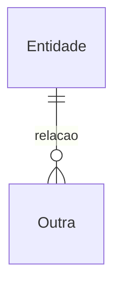
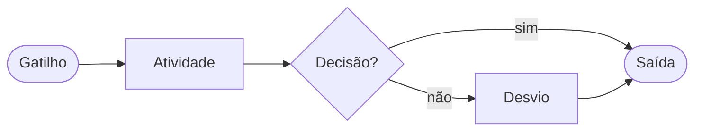
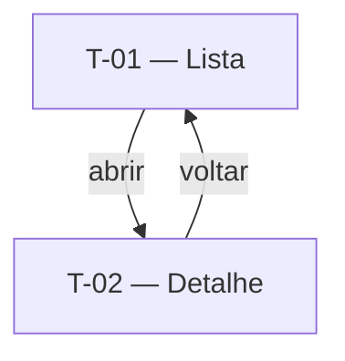

# <Produto> — Especificação

> <Uma frase: o que esta spec cobre e o que ela não cobre.> Convenções:
> `*(inferência)*` marca o que foi inferido; `⚠ NÃO IDENTIFICADO — definir: <pergunta>`
> marca lacuna. Requisito funcional é escrito em EARS-PT (ver `docs/CONVENCOES-V3.md`).

## 1. Contexto

### 1.1 Problema
<Situação atual e a dor concreta. Narrativa curta.>

### 1.2 Objetivo
<Resultado verificável em linguagem de negócio.>

### 1.3 Personas e necessidades

| Persona | Necessidade | ID |
|---|---|---|
| <persona> | <o que precisa alcançar> | JTBD-01 |

### 1.4 Não-objetivos
- <o que esta spec deliberadamente não resolve>

## 2. Glossário

| Termo | Definição | Fonte |
|---|---|---|
| <termo> | <definição no vocabulário do domínio> | <fonte> |

## 3. Regras de negócio

| ID | Regra | Fonte |
|---|---|---|
| RN-01 | <invariante do domínio> | <documento ou interlocutor> |
| RN-AI-01 | <regra que depende de IA, se houver> | <fonte> |

## 4. Modelo de dados

Entidades canônicas do produto. Feature descreve só o que é próprio dela (§7.N.5).

### 4.1 Entidades
- **<Entidade>** — <definição> · campos-chave: <campo, campo>.

### 4.2 Relações



## 5. Requisitos transversais

Único lugar onde requisito **não-funcional** existe. Feature cita por ID (§7.N.4).

### 5.1 Não-funcionais

| ID | Requisito | Mecanismo |
|---|---|---|
| RNF-T-SEG-01 | <requisito de segurança> | <como se cumpre> |

### 5.2 Funcionais transversais

| ID | Requisito (EARS-PT) | RNs |
|---|---|---|
| RF-T-01 | <enunciado> | RN-01 |

### 5.3 Integrações

| Sistema | Papel | Direção | Criticidade | Features |
|---|---|---|---|---|
| <sistema> | <papel no processo> | entrada / saída / ambas | alta / média / baixa | <7.1, 7.3> |

## 6. Arquétipos de tela

### A-01 — <nome do arquétipo>
Quando usar: <critério>.

```wireframe
# <título>
[[ a | b | c ]]
[Ação]
```

## 7. Features

### 7.1 <Nome da feature>

**Eixo:** processo | classe · **Apetite:** <2 semanas | 6 semanas> · **Fora desta feature:** <no-gos>

#### 7.1.1 Fluxo e navegação





#### 7.1.2 Telas

##### T-01 — <nome>
- **Arquétipo:** A-01
- **Objetivo:** <para que serve>

```wireframe
# <nome da tela>
[[ resumo | status ]]
[Ação primária]
```

- **Conteúdo:** <que informação exibe>
- **Ações:** <o que o usuário faz>
- **Estados:** <vazio, carregando, erro>
- **Componentes:** <nomes genéricos — ver Anexo A>

#### 7.1.3 Requisitos funcionais

| ID | Enunciado (EARS-PT) | Prioridade | RNs |
|---|---|---|---|
| RF-01 | O sistema deve <resposta> | Must | RN-01 |
| RF-02 | Quando <gatilho>, o sistema deve <resposta> | Must | RN-01 |
| RF-03 | Se <gatilho>, então o sistema deve <resposta> | Must | RN-02 |

**Transversais aplicáveis:** `RNF-T-SEG-01`, `RF-T-01`.

#### 7.1.4 Cenários de teste

##### CT-01 — <título> (verifica RF-01)
- **Dado** <estado inicial concreto>
- **Quando** <ação ou evento>
- **Então** <resultado observável>

#### 7.1.5 Dados

Entidades canônicas usadas (§4): <Entidade>, <Entidade>.

##### <entidade_propria>
| Campo | Tipo | Descrição |
|---|---|---|
| <campo> | texto / número / data / booleano / referência | <descrição> |

## 8. Questões em aberto
- ⚠ NÃO IDENTIFICADO — definir: <pergunta acionável>

## 9. Fontes

| Referência | Tipo | Observação |
|---|---|---|
| <documento> | ata / transcrição / apresentação | <observação> |

## Anexo A — Vocabulário de componentes

Nomes genéricos de front usados nas telas, agnósticos de framework: toolbar, card,
table, list, button, input, select, slider, tabs, dialog, chart, banner. Cada projeto
mapeia para sua lib concreta.

## Anexo B — Cadeia de valor

| Etapa | Features |
|---|---|
| <etapa do processo de negócio> | <7.1, 7.2> |
