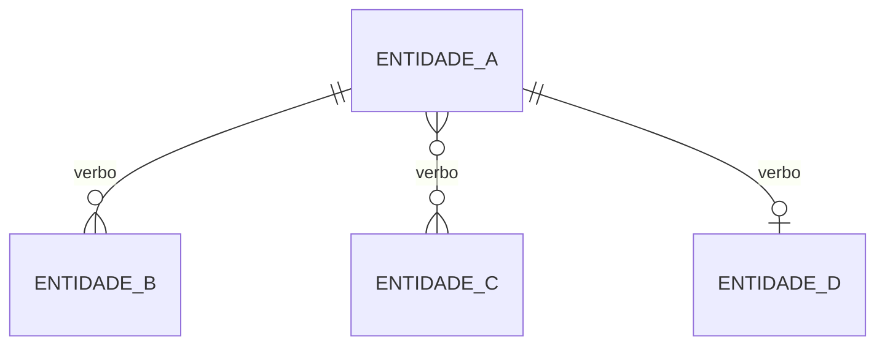

# Modelo de Dados (transversal)

Este é o **modelo de dados canônico de `<produto>`**, compartilhado por todas as features.
Cada feature **referencia** estas entidades em vez de redefini-las; no seu Cap. 3 (Dados),
cada feature descreve apenas os campos e as entidades **próprios** dela (configurações,
logs e instâncias de execução), apontando para a entidade canônica de origem definida
aqui. O objetivo é **minimizar complexidade e eliminar a duplicação** que surge quando a
mesma entidade é remodelada em cada feature. A terminologia segue o
[Glossário](visao.md) (Visão §2); valores numéricos são parâmetros de instância
(`RN-NN`, Visão §3). Inferências estão marcadas com `*(inferência)*` e lacunas com `⚠`.

> **Home feature.** Cada entidade canônica tem uma *feature-lar* que a define e a alimenta;
> as demais features apenas referenciam. As tabelas de execução/log de cada feature **não**
> são canônicas — vivem no Cap. 3 da própria feature e referenciam estas entidades.

---

## Entidades

<!-- Uma subseção por entidade canônica do domínio. Liste só as entidades realmente
compartilhadas; tabelas de log/execução específicas de uma única feature ficam no Cap. 3
daquela feature. -->

### <Entidade>

<Descrição em 1–2 frases: o que é, qual o papel no domínio, a que termo do Glossário
corresponde.>

| Campo | Tipo conceitual | Descrição |
|---|---|---|
| id | identificador | Chave da entidade |
| <campo> | <identificador / texto / número / data / booleano / enum / monetário / referência / composto / lista> | <descrição; cite a `RN-NN` que governa o campo, se houver> |
| <campo_ref> | referência | → <Outra Entidade> |

**Usada em:** <feature-lar (home)>, <demais features que referenciam>.
<!-- Sub-entidades (ex.: linhas/itens de uma entidade-pai) podem ser descritas em prosa
logo abaixo da tabela. -->

### <Entidade Transversal Global>

<Entidades que quase toda feature referencia — ex.: Usuário/Perfil de acesso, Evento de
Auditoria — descreva-as aqui uma única vez.>

| Campo | Tipo conceitual | Descrição |
|---|---|---|
| id | identificador | Chave |
| <campo> | <tipo> | <descrição> |

**Usada em:** <feature-lar (home)>, e como entidade referenciada por **todas** as features.

---

## Relações

<Liste as relações entre as entidades acima, em prosa, com cardinalidade.>

- <Entidade A> **1:N** <Entidade B> — <descrição>
- <Entidade A> **N:N** <Entidade C> (via <Entidade de junção>) — <descrição>
- <Entidade A> **1:1** <Entidade D> — <descrição>

> Notação Mermaid `erDiagram`: `||--o{` = 1:N · `}o--o{` = N:N · `||--o|` = 1:1 (opcional)
> · `||--||` = 1:1 (obrigatório). Use os nomes das entidades em MAIÚSCULAS, sem acento.

---

## Relacionado
- [Índice do wiki](index.md)
- [Visão do produto](visao.md)
- [Requisitos transversais](requisitos-transversais.md)
- [Telas comuns (arquétipos)](telas-comuns.md)
